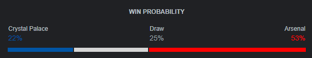

# Draft
Everyone in the league will be assigned a random draw number. If there are 10 or fewer, everyone will get two draws (to encompass all 20 clubs in the league). If there are more than 10, only one club will be drawn per league member.

If league memebers draw twice, a snake method will be used for the second draft order. 
i.e. 1,2,3,4,4,3,2,1

# Trade
Your club picks will be yours for the remainder of the season. You may agree to trade with another league member. A club can only be traded twice in a season. All trades must be approved by a majority of the league members not involved in the trade. Trading will be closed in the final 4 weeks of the 38 week season.

# Score  
When your club wins, you receive an amount of points equivilant to the inverse of their Win Probability. Win Probability is an official stat generated by the EPL. 

i.e. If the Win Probability of your club is 65%, you receive 35 points (100 - 65 = 35). 

In this manner, a good club will generally have a higher "Win Probability", for lower points, but will also likely win more often. 

A bad club will generally have a lower "Win Probability", for higher points, but will also likely win less often

A draw will result in half the number of points you would have received for a win.

